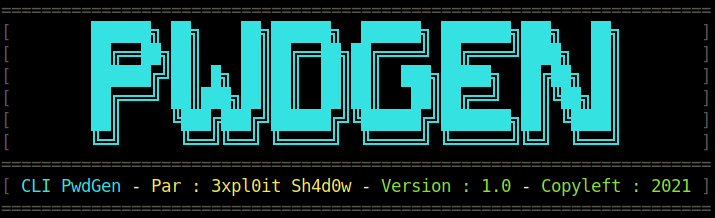

<p align="center">
  
</p>

[](https://www.gnu.org/licenses/quick-guide-gplv3.fr.html)
[](https://fr.wikipedia.org/wiki/Bourne-Again_shell")

🇬🇧 Bash script to randomly generate passwords.<br>
🇫🇷 Script Bash permettant de génerer aléatoirement des mots de passe.
# Requirements :
`GIT` & `BASH` and `ZENITY`.
# Installation :
🇬🇧 Open your Terminal and copy this Command :<br>
🇫🇷 Ouvrez votre Terminal et copiez cette Commande :<br>
```bash
git clone https://github.com/3xpl0it-Sh4d0w/PwdGen.git && cd PwdGen && chmod +x PwdGen.sh
```
🇬🇧 To execute the Script do : `./PwdGen.sh or bash PwdGen.sh` Enjoy ! 🙂.<br>
🇫🇷 Pour executer le Script faites : `./PwdGen.sh où bash PwdGen.sh` Bonne utilisation ! 🙂.
